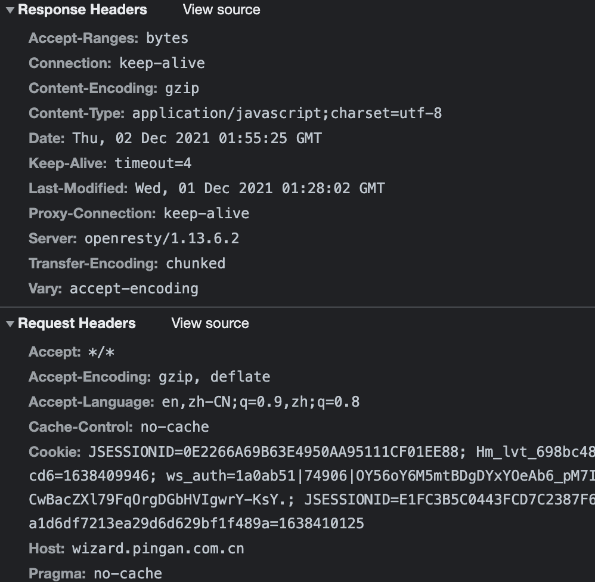
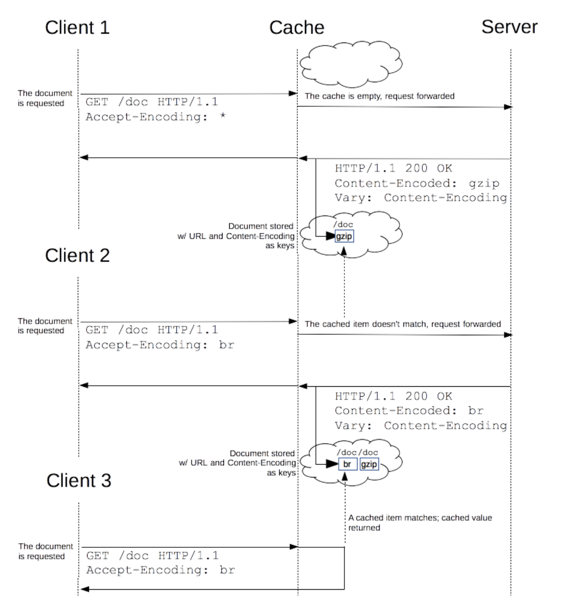

# 缓存
缓存是一种保存资源副本并在下次请求时直接使用该副本的技术。当web缓存发现请求的资源已经被存储，它会拦截请求，返回该资源的拷贝，而不会去服务器重新下载。目的是为了缓解服务器压力，提升性能。网络方面的缓存分为DNS缓存、http/浏览器缓存、CDN缓存。这里先记录一下http缓存的操作，一般也叫浏览器缓存。

## http/浏览器缓存

常见的http缓存操作一般用于静态资源缓存，只能缓存`GET`响应，对于其他类型的响应无能为力。

### 缓存控制

1、Expires

`Expires`：指定在此时间后，响应过期。

2、 Cache-Control

`Cache-Control` 通用消息头字段，被用于http请求和响应中，通过指定的配置来实现缓存机制。缓存指令是单向的，也就是请求中设置的指令不一定被包含在响应中。

图示：

* max-age: 缓存存储的最大周期，超时即缓存失效。时间的计算起点是响应报文创建的时间，而不是客户端收到响应的时间。设置为0即不使用缓存。**如果设置了max-age或s-max-age,那么Expires头会被忽略。**

* no-store: 不使用任何缓存，始终命中网络。

* no-cache: 可以缓存，但使用之前必须与服务器重新验证。如果缓存未过期，则使用缓存，否则走协商缓存。

* must-revalidate: 类似no-cache，如果缓存未过期则使用缓存（无需验证），如果缓存过期就要询问服务器是否可以继续使用。例如：Cache-Control: must-revalidate, max-age=600，10分钟后向服务器请求，如果没有新的资源，返回（304）；否则获取最新资源，返回200

其中指定了`no-cache`和`must-revalidate`表示客户端可以缓存资源，每次使用缓存必须重新验证其有效性，每次都会发起http请求，如果缓存内容有效则可以跳过http响应体的下载。

### 缓存过期策略

* 缓存中只有有限的空间用于存储资源副本，因此会定期清理副本，这叫缓存驱逐。
* 当服务器资源进行了更新，缓存中对应的资源也要更新，因此请求-应答双方需要为该资源约定一个过期时间。

#### 条件请求

HTTP请求中就定义了“If”开头的“条件请求”字段，用于验证缓存的资源是否过期。客户端请求资源时，如果发现缓存过期，使用以下标识处理：

* 服务器返回响应头部`Last-Modified`首部中会带有资源上次修改时间。
  
* `If-Modified-Since` 是一个条件式请求首部，意思是资源最近修改时间。
  
* 服务器返回响应头部`ETag`，作为缓存内容的唯一标识。

* `If-None-Match` 是一个条件式请求头部，意思是如果服务器的没有资源的`ETag`属性值与`If-None-Match`值匹配的时候，服务端会返回请求的资源，响应码`200`。否则，返回`304`。优先级高于`If-Modified-Since`。

缓存处理图示：

## 浏览器访问页面操作

* 前进/后退：不向服务器发请求，直接使用缓存
* ctrl + f5: 强制刷新，浏览器缓存直接过期
* 点击刷新或f5刷新：浏览器缓存过期，走协商缓存，向服务器验证缓存是否仍然可用。
  
## 参考

[HTTP缓存](https://developer.mozilla.org/zh-CN/docs/Web/HTTP/Caching)
