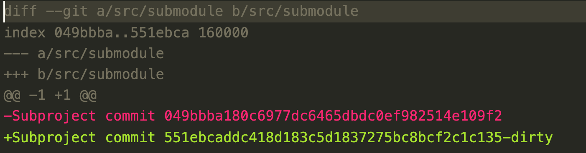
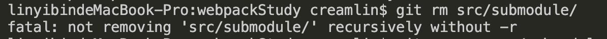
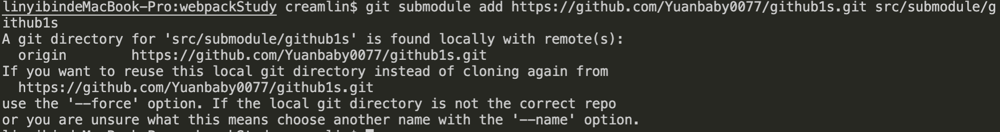
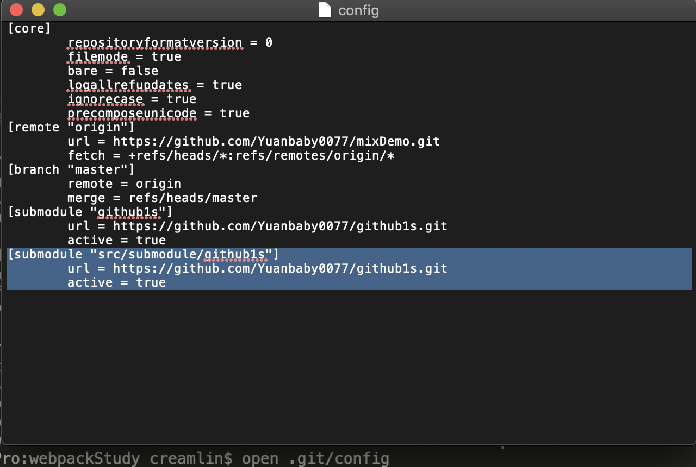
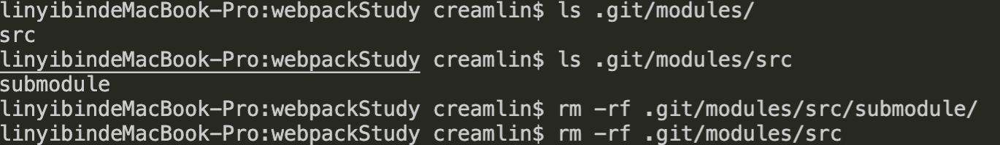
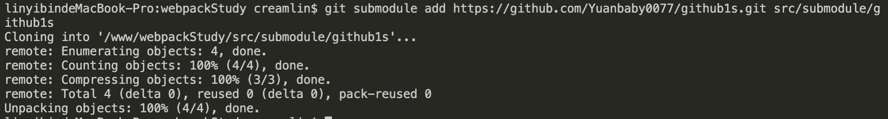
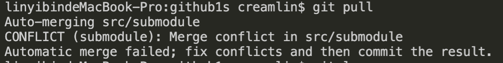
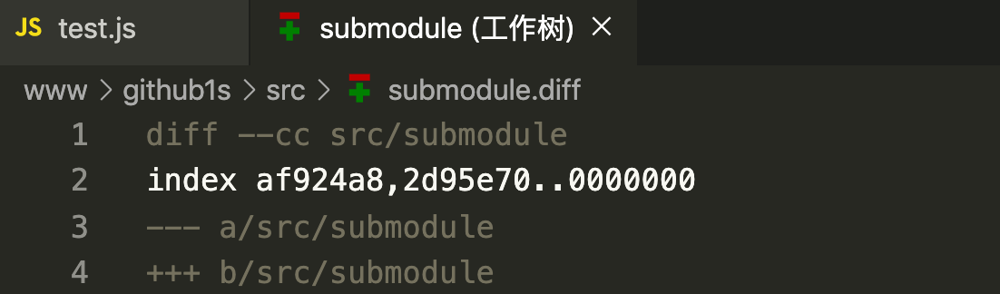

# git submodule

## 学习起源

相遇即是缘，学习`git submodule`是正好有两个项目中都需要用到同一个功能模块。Git中通过子模块来解决这个问题。子模块是独立的代码库，可以作为主应用的子目录，提交的时候二者保持独立。

下面使用webpackStudy项目和github1s来作为例子来演示子模块的相关命令

## git submodule 命令

### 添加子模块 命令

  `git submodule add [<options>] <repository> [<path>]`

* 执行命令
`git submodule add https://github.com/Yuanbaby0077/github1s.git src/submodule/github1s`

* 执行 `cat .gitmodule` 查看配置

`.gitmodule`文件保存了子模块的仓库地址和当前所在目录的映射
```
[submodule "src/submodule/github1s"]
	path = src/submodule/github1s
	url = https://github.com/Yuanbaby0077/github1s.git

```
* 添加多个子模块后 查看.gitmodule

```
[submodule "src/submodule/github1s"]
	path = src/submodule/github1s
	url = https://github.com/Yuanbaby0077/github1s.git
[submodule "src/submodule/testXXX"]
	path = src/submodule/testXXX
	url = https://github.com/Yuanbaby0077/testXXX.git
```

* 执行 `git diff` 查看差异

### 克隆含有子模块的项目

  * 方法一
  ```
    git clone <main>
    cd <main>
    git submodule update --init // git submodule init 和 git submodule update
  ```
  * 方法二
  
  `git clone <repository> --recursive` 或者 `git clone --recurse-submodules <repository>`

  执行命令
  `git clone --recurse-submodules https://github.com/Yuanbaby0077/mixDemo.git`

### 更新子模块 命令

  * 方法一
  ```
    cd <main>
    git pull
    git submodule update
  ```

  * 方法二
  ```
    cd <submodule>
    git checkout master
    cd ..
    git submodule foreach git pull
  ```

### 撤销更改

如果子模块有任何修改过的文件或未跟踪的文件，那么执行`git diff`显示的子模块



`git submodule foreach --recursive git checkout .`


###  删除子模块 命令
  `git rm <submodule>`

  * 首先执行：
  `git rm -r src/submodule/`

    

  * 重新添加子模块翻车现场
  

  * 于是，执行`open .git/config` 删除.git/config的submodule配置源文件
  
  
  * 重复执行步骤2 继续翻车，于是查了下资料，需要删除`.git/modules`下的submodule，执行以下命令
    `rm -rf .git/modules/src/submodule`

    

  * 重新执行步骤2 成功
  

### 子模块冲突

如果其他提交和当前提交可以快进式合并，则不存在冲突，
如果子模块提交已经分叉且又需要合并，则会如下提示

>linyibindeMacBook-Pro:github1s creamlin$ git pull
>Auto-merging src/submodule
>CONFLICT (submodule): Merge conflict in src/submodule
>Automatic merge failed; fix conflicts and then commit the result.


解决冲突：

`git diff`
>diff --cc src/submodule
>index af924a8,2d95e70..0000000
>--- a/src/submodule
>+++ b/src/submodule

这里记录了两个commitID， af924a8 和 2d95e70


>commit af924a87872369a4b09ae9bd7e0fd4bb82447175 (HEAD -> main)
>Author: yuanbaby <15396080077@163.com>
>Date:   Wed Mar 31 14:34:10 2021 +0800
>
>    update
>
>commit 049bbba180c6977dc6465dbdc0ef982514e109f2
>Author: yuanbaby <15396080077@163.com>
>Date:   Wed Mar 31 14:29:25 2021 +0800
>
>    feat: add

>commit 2d95e70296b887d6aa0e72baa78fefc648f01b59
>Author: yuanbaby <78551876+Yuanbaby0077@users.noreply.github.com>
>Date:   Thu Feb 25 21:21:10 2021 +0800
>
>   Initial commit

当前子模块目录中应该是基于af924a8这次的提交，因为合并没有动过子模块的文件。

另一个commitId:2d95e70 通过为他创建一个分支然后尝试合并。

* `cd submodule`
* `git rev-parse HEAD`
> af924a87872369a4b09ae9bd7e0fd4bb82447175
* `git branch try-merge 2d95e70`
* `gie merge try-merge`

这时会得到一个真正的合并冲突，按照常规来解决即可


## 参考
[协同开发利器-Git Submodule](https://cloud.tencent.com/developer/article/1585901)

[GIT-工具-子模块](https://git-scm.com/book/zh/v2/Git-%E5%B7%A5%E5%85%B7-%E5%AD%90%E6%A8%A1%E5%9D%97)


