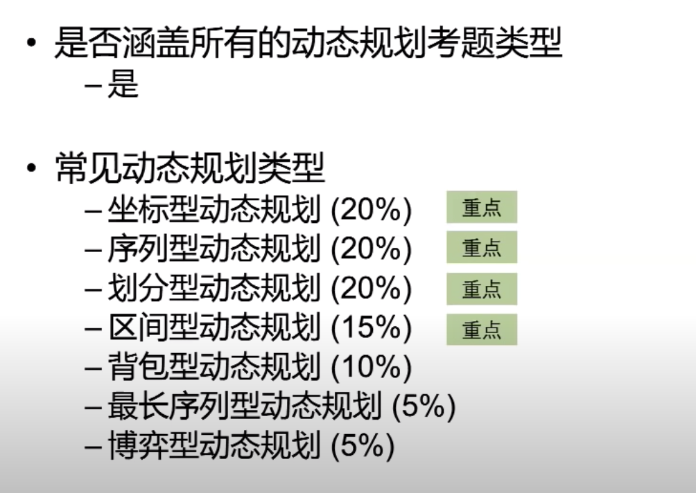

# 动态规划

## 特点

* 计数：有多少种方式走到右下角/有多少种方法选出k个数 和为sum/跳台阶？/
* 最值：从左上角到右下角的最大数字和/最长上升子序列长度
* 存在性：取石子游戏，先手是否取胜/能不能选出K个数，和为sum

## 解题步骤

### 确定状态 

* 状态的作用在动态规划中的作用属于定海神针
* 解动态规划需要开一个数组，每个数组元素f[i]或者f[i][j]代表什么
* 确定状态需要两个意识
    - 最后一步
    - 子问题

### 转移方程
  * 设状态f(x) = 最少用多少枚硬币拼成x
  * 对于任意x，都有
  f[x] = min(f[x - 2] + 1, f[x - 5] + 1, f[x - 7] + 1)

### 初始值和边界条件

  数组下标[x - 2], [x - 5], [x - 7]小于0，怎么办？什么时候停下来？

  如果不能拼成Y，就设置为正无穷

  初始条件： f[0] = 0, 用转移方程算不出来的，需要手动定义
  f[-x] = Infinity
  边界条件： 不要数组越界

### 计算顺序的确定

比如从小到大，左边的计算值已保存下来，不用重复计算了。
* 初始条件：f[0] = 0
* 计算f[1],f[2],f[3]...f[27]
* 当计算到f[x]时，f[x - 2],f[x - 5], f[x - 7]都已经有结果了 

## 例子

例如：硬币问题

2， 5， 7 组合，得到27，使用的硬币数最少


状态：
  
  最后一步：K 个硬币，加起来和为27，即 a1 + a2 + ... + ak = 27
  子问题： 使用最少的硬币组成 27 - ak，其中ak的值是[2, 5, 7]，
  那么27 - ak的情况如下：
    当 ak等于2，f(27) = f(27 - 2) + 1（1是ak面值是2的这枚硬币）
    当 ak等于5，f(27) = f(27 - 5) + 1（1是ak面值是5的这枚硬币）
    当 ak等于7，f(27) = f(27 - 7) + 1（1是ak面值是7的这枚硬币）

  最后，取三个中的最小值 f(27) = min(f(27 - 2) + 1, f(27 - 5) + 1, f(27 - 7) + 1)

### 递归解法

缺点： 计算重复，时间复杂度高
```
let  i = 0
function fn(n) {
  console.log(i++)
  if (n < 0) return Infinity
  if (n === 0) return 0
  return Math.min(fn(n - 2) + 1, fn(n - 5) + 1, fn(n - 7) + 1)
}

console.log(fn(27)) // 运算次数 3783

```

青蛙跳台阶，可以一级一级的跳，也可以二级二级的跳，当有N个台阶，有几种跳法

假设有10级台阶，设置数组arr,length 为10

最后一步：第十级台阶的跳法 

当青蛙处于第9级台阶，跳一步到第10级
当青蛙处于第8级台阶，跳二步到第10级
因此，跳到第十级台阶的方式为 跳到第8级的跳法 + 第九级的跳法
f[10] = f[9] + f[8]

转移方程： f[x] = f[x - 1] + f[x - 2]

初始值：f[1] = 1
f[2] = 2

边界条件：不越界

顺序，从小到大，保存小的值

考点

[动态规划专题](https://www.youtube.com/watch?v=j4eab7N3Hfs)




